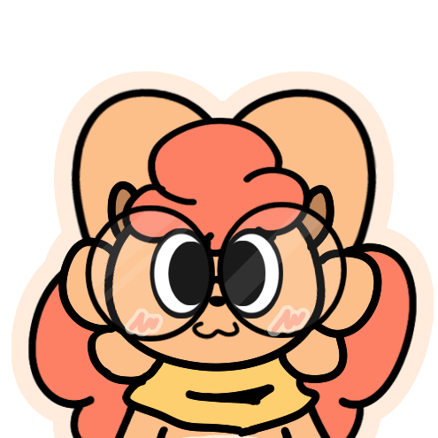

# Cookiaria Website
website for personal stuff / tools / blogs, tutorials, shortcuts / introduction and some bullshit

written from scratch! everything from the jekyll theme, styles, codeblocks, etc is made from scratch. this is a remake from my old website, at [/cookiaria/website-thingy](https://github.com/cookiaria/website-thingy).

---

if you want to use this theme, well... this isn't really meant for public use (yet), sorry!

but if you have the time, you can clone this repo:
```sh
git clone https://github.com/Cookiaria/website-redux.git
```
```sh
cd website-redux
```

you can just rewrite everything. all you need to do is remove some html files (keep `index.html` though!), and make it your own. i made it as dynamic as possible, you can change pretty much every color easily on the `/assets/css/main.css` file, from the text color, accent color, background (color, image tile), width of the page, the border radius, etc.

i'll make a template version of this in the future, but for now, this is what you get

also yes, i'm aware you can pretty much download all of my art by cloning the repo... i just hope this doesn't get abused, but i should proobably look up how to host a backend for it in the future. just not right now, i don't have that much time.

## credits:

- Google Fonts (using Fredoka, Ubuntu Mono)
- Nerdfonts (icons for the tabs, and  for codeblocks)
- icymaxi (art/some website assets)
- RobTopGames (website logo, icon 98 / throbber gif for /gallery, ball 34)


 help m

